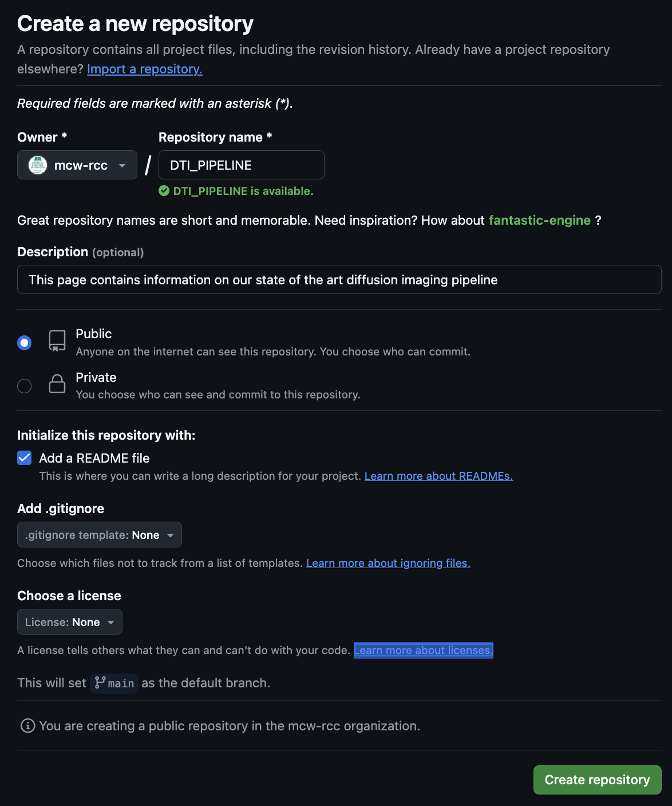
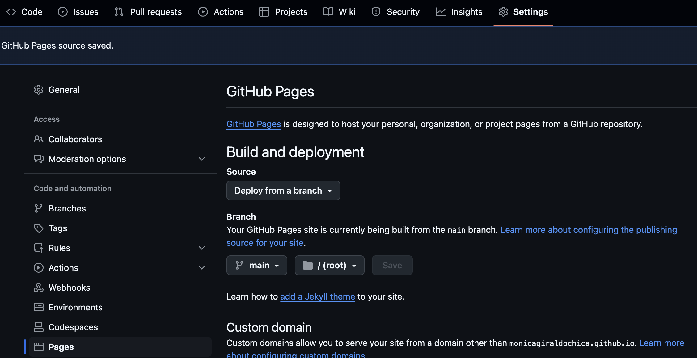
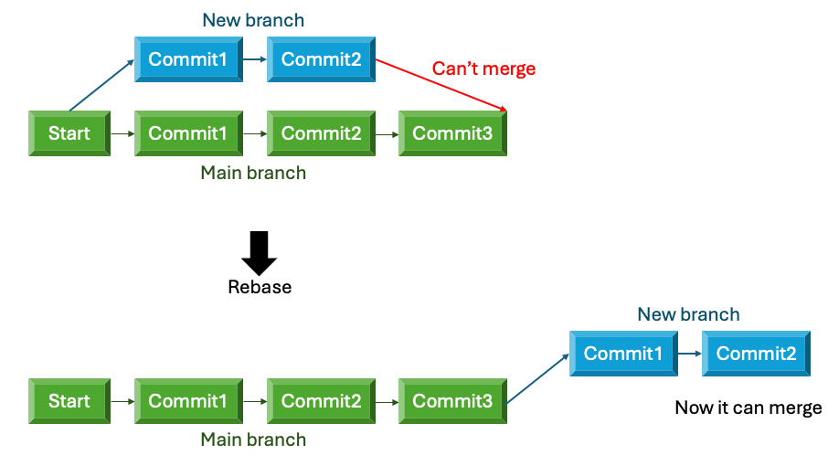

# Git and GitHub (advanced)

In this guide you will learn how to create a GitHub page to host lab documentation and share scripts, work with branches and resolve merge conflicts. In order to follow this guide, it is a pre-requisite to have some basic knowledge in Git and GitHub. If you are new to these tools, please visit our [Beginners guide](git.md).

## GitHub Pages

We will start by creating a new repository to host the documentation for a research project. Log into the account that you created for your laboratory and go to [create new repository](https://github.com/new){:target="_blank"}. Choose a suitable name and make sure it is Public. Visibility must be public for a GitHub Page. Normal repositories, used only for storing scripts and other files, can be private. It is a good idea to always add a README file when creating a new repository, at minimum saying what is the purpose of the repository, but this is not mandatory. Adding a description is also optional. You can choose to [add a license](https://docs.github.com/en/repositories/managing-your-repositorys-settings-and-features/customizing-your-repository/licensing-a-repository){:target="_blank"} to inform people what they can or cannot do with your code. Finally, click on "Create repository" at the bottom of the page.

{width="600"}

Now you can clone your repository in your local computer. The URL of your project will be of the form `https://github.com/username/repo_name.git`.

You can do that in the command line:

```bash
git clone https://github.com/mcw-rcc/DTI_PIPELINE.git
```

Or in [GitHub Desktop](https://desktop.github.com/){:target="_blank"}. Here you can select the URL tab and paste the URL of your GitHub repository or choose the GitHub.com tab and paste only the project name (in our example that would be `DTI_PIPELINE`):

{width="600"}

Next, create an index.md or index.html file and any other files that will be part of the web page for your lab. Below is an example of what a very simple index.html file could look like. If you are new to Markdown or HTML, visit our [programming guide](programming.md) section where we have links to very good programming tutorials for different languages.

<!-- markdownlint-disable MD046 -->
=== "index.html"

    ```html
    <!DOCTYPE html>
    <html>
    <title>DTI pipeline</title>
    <body>
    <h2>DTI pipeline</h2>
    <p>In this page you will find information about our state of the art DTI processing pipeline.</p>
    </body>
    </html>
    ```

=== "index.md"

    ```markdown
    # DTI pipeline
    
    In this page you will find information about our state of the art DTI processing pipeline.
    ```

To update the remote repository with the new file, we first add `index.html` to the Staging Environment using `git add`. This is where Git stores the list of changes that you want to commit. You can add or remove things from this environment before doing a commit:

```bash
# Add all modified files to the Staging Environment
git add --all
# Commit all changes in the Staging Environment
git commit -m "created index file"
# This will synchronize the remote repository with the local changes
git push origin
```

Finally, enable GitHub Pages for the repository. Go to the Pages Settings of your repository: `https://github.com/username/repo_name/settings/pages`. Then, in Build and deployment, under Source, select Deploy from a branch. And under Branch, select the main branch. Click on Save.

{width="600"}

your site should be live at `https://username.github.io/repo_name`. Repeat this process for any individual projects.

Now you can create the main page for your lab and add links to the individual project pages. The process is the same as described above except that the name of the repository **must** be the same as your username. This main page will be hosted at `https://username.github.io`.

## Git Branches

Git branches allow you to create isolated spaces to develop new features, modify code or fix bugs without affecting your main line of development. When the code in the new branch is stable and finished, you can merge it with the main branch. Each repository can have multiple branches and you can switch between them easily. Remember that the `git` commands that you execute will modify the repository in which you are located. To change repository, navigate to the folder of the corresponding repository. When you commit to a branch, those changes will not affect the main branch nor will be made public until you merge the two branches.

{width="600"}

### Updating local repository

In order to avoid potential merge conflicts, download the latest changes from the remote repository before creating a new branch. `git fetch` will not integrate those changes with your local repository, nor will modify your local files. It will just give you a view of what has happened in your the repository. `git status` will allow you to visualize the status of the local repository compared to the remote.

```bash
git fetch origin
git status
```

If your main branch is up to date with `origin/master` (the remote repository in GitHub), or if it's a few commits ahead but no commits behind, you can safely create a new branch and proceed with the instructions on [how to create a new branch](#creating-a-new-branch). If you are a few commits behind the remote branch, you can try to `pull` all changes from the remote repository in order to update the local. If there are no conflicts, your branch will be merged with the remote (locally) and you can now safely create a new branch and do any necessary edits to your code:

```bash
git pull origin
```

If there are any conflicts, you must resolve them manually before merging or creating a new branch. Please see the section below on [how to resolve conflicts](#merge-conflicts).

### Creating a new branch

```bash
# Create and switch to a new branch called test
git checkout -b test
```

### Updating remote repository

After editing your files, you can use `git status` to see the list of files that have been deleted, created or modified but not yet committed. At this point all changes are local and have not been updated in your remote repository. You might see a list of untracked files, these are those that are new (since the latest commit) and haven't been added yet to your remote repository. In order to commit any changes, you first must add them to the Staging Environment using `git add` and then commit everything that is in this environment. The Staging Environment tells Git what you want to commit. If you want to add all modified files to the Staging Environment, you should use `git add --all` as in the example below. To only add specific file(s) or directories, you list each of them like so: `git add myfile1.txt myfile2.txt mydirectory/`. If you change your mind and decide to remove one of those files from the Staging Environment before a commit, you can use `git reset HEAD myfile.txt`.

```bash
# Add all modified files to the Staging Environment
$ git add --all
# Commit changes to your new branch
$ git commit -m "Added new functionality to the brain extraction script"
# Push your commit from the local repository to the remote
$ git push origin test
```

If you get an authentication error, make sure that your [personal access token](https://docs.github.com/en/authentication/keeping-your-account-and-data-secure/managing-your-personal-access-tokens){:target="_blank"} is not expired. After successfully running the `push` command, your new branch is updated in the remote repository, but it's not yet merged with the main code.

### Merging branches

If the repository belongs to you and you don't need to have anybody review the changes that you made, you are now ready to merge your local and remote branches and publish your updates.

```bash
# Switch to the main branch
git checkout main
# Merge with test
git merge test
# Delete test
git branch -d test
# Check the status of the local repository compared to the remote
git status
# Push the commit to synchronize the repositories
git push origin
```

On the other hand, if the repository doesn't belong to you or you have collaborators and you need them to review the changes, you should create a pull request. You can do this by following the link printed when you executed the `git push origin test` command. The link will have the following format, where `test` is the name of your working branch: `https://github.com/username/repo_name/pull/new/test`.

## Merge conflicts

You must resolve all conflicts before you can successfully merge your branch with the base branch.

### Manual fix

You can use `git status` to see the list of files that have conflicts. If only a few files have conflicts and they arose because two developers did different edits on the same file, fixing those conflicts is relatively easy. Open each of those files in any editor and you will see the lines that have conflict. Between `<<<<<<< HEAD` and `=======` you will see the changes made in the base branch and between `=======` and `>>>>>>> other_branch` you will see the changes made in `other_branch`. Delete those conflict markers and make the final changes that you want to keep.

Then, add the changes to the Staging Environment, commit your changes, and synchronize the local and remote repositories:

```bash
git add .
git commit -m "Resolved merge conflict"
git push origin
```

If the conflict arose because a file in one of the two branches was edited and in the other was removed, the solution is also simple. If you want to keep the files, add it back to your repository:

```bash
git add deleted_file.md
git commit -m "Resolved merge conflict by adding the file that was deleted"
git push origin
```

If you decide to remove the file from the repository:

```bash
git rm deleted_file.md
git commit -m "Resolved merge conflict by deleted the conflicting file"
git push origin
```

### Rebasing

If the main branch progressed since you started working on your current branch, you will be some commits ahead and some commits behind the main branch. In this case, it will be more complicated to fix the conflicts using the method above and you will need to rebase your branch. This will allow you to obtain the latest changes done to the main branch, while keeping the ones you did in your current branch. Rebasing is moving the starting point of the commits in your new branch, so that the base of those changes is an updated version of the main branch.



In order to rebase your new branch and put all the commits to the head of `origin` (the remote main branch), you would type the following commands. `git branch` shows the branch that is activated with an asterisk. it is important to make sure that the correct branch is activated (the one you want to rebase, in this example `test`), before doing the rebase.

```bash
git branch
git rebase origin
```

You can rebase to any other branch, not necessarily has to be `origin`. It is not suggested to rebase if you already pushed your changes because it will modify your commit history. In that case, you will have to undo some of the changes you made, separate your branch in one or more branches. or do an [interactive rebasing](https://git-scm.com/book/en/v2/Git-Tools-Rewriting-History){:target="_blank"}.

### Other options

As merge conflicts get more complicated to resolve, you might need to [reset, checkout or revert](https://www.atlassian.com/git/tutorials/resetting-checking-out-and-reverting#:~:text=For%20this%20reason%2C%20git%20revert,is%20for%20undoing%20uncommitted%20changes.){:target="_blank"} some of the changes and commits that you did in your branch.

[Moving some uncommited changes to a new branch](https://betterstack.com/community/questions/move-uncommited-work-to-new-branch/){:target="_blank"} is another option that would allow you to merge some of the changes that you made and separate the more complicated conflicts into a different branch.

Finally, to investigate further all conflicts, you can [check the list of commits in the repository's history](https://www.freecodecamp.org/news/git-log-command/){:target="_blank"}.

### Professional documentation

You can create a professional static site like this one to host your documentation using [MkDocs](https://www.mkdocs.org/)){:target="_blank"} and [MkDocs Material](https://squidfunk.github.io/mkdocs-material/){:target="_blank"}. These will allow you to use customizable themes with advanced navigation and search options.
